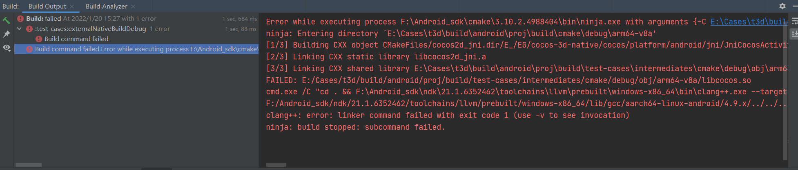

# 安卓开发时可能踩过的陷阱

## 安装时可能踩到的坑

### SDK的路径和NDK的路径

区分环境变量`SDK_ROOT`，`NDK_ROOT`，`NDK_HOME`。

正常下载安卓SDK时我们可以选择路径，而NDK则会自动下载到SDK路径下。此时`ANDROID_SDK_ROOT`假设为`F:\android_sdk`。在我第一次接触到这一套逻辑时，我自然而然的认为`ANDROID_NDK_ROOT`和`ANDROID_NDK_HOME`是同一个路径。即`F:\android_sdk\ndk`。毕竟主页和根的意义很像不是吗？

但是实际上这个路径下会出现各个版本的NDK，比如`18.1.5063045`或者`23.0.7599858`。这几个目录才是我们需要设置的`NDK_HOME`。因为`ANDROID_NDK_ROOT`所表示的是包含各个版本的ndk的路径。`ADNROID_NDK_HOME`所表示的是带有`ndk-build` `ndk-stack`等工具的路径。


NDK存在于SDK目录下，但是NDK_HOME的环境变量却不是指向这个目录，而是该目录下的任意ndk。比如F:\Android_sdk\ndk\23.0.7599858
这在大部分的项目编译中都需要用到。比如V8的编译，但是如果设置错误则会导致工具链找不到。

## 打开项目可能踩到的坑

gradle maven

## 编译时可能踩到的坑

### 符号缺少的问题


### AndroidManifest.xml的属性

Android 项目本身由多个部分组成，包含app属性的AndroidManifest.xml，其中Activity也在

## 运行时可能踩到的坑

Android api 31 在 AndroidManifest的编写上有着一个新增的条件

```xml
android:exported=true
```

这个属性的效果是将本activity暴露给外部，这让别的应用可以跳转到本activity。

## Task List


## Debug冲突

一个简单的问题但是却是经常出现的坑：前一个debug没有结束，后一个就安装不了无法调试
  
