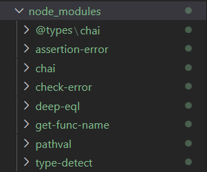

在cocos项目中加入chai断言库需要明确一件事，chai作为npm库需要同时导入@types/chai作为TS的module。但同时chai是通过commonJS导出的

关于CommonJS导出的各种知识可以参考

<a href="https://es6.ruanyifeng.com/#docs/module-loader#ES6-%E6%A8%A1%E5%9D%97%E4%B8%8E-CommonJS-%E6%A8%A1%E5%9D%97%E7%9A%84%E5%B7%AE%E5%BC%82" > 
 阮一峰的ECMAScript入门--ES6-模块与-CommonJS-模块的差异 </a>

所以针对CommonJS导出的模块我们需要在tsconfg文件中加入
```json
"compilerOptions": {
      ...
      "allowSyntheticDefaultImports": true,
      ...
  },
```
同时，加入之后的node_module 结构应该是这样的


allowSyntheticDefaultImports配置可以

## 添加Event到批处理流程中

在测试过程中需要通过发送消息-》接受消息并切换状态的方式进行持续的集成。
通过简单的事件处理机制就可以做到观察者模式的预期。

```ts
const ONTAP = new Event("TAP");
  
window.addEventListener("TAP",()=>{
    console.log("@HElLO");
});

...
window.dispatchEvent(ONTAP);
```

现在的预期目标是在不同的场景里都能调用相同的Event，同时能够对自己的功能进行实现。那么我们可以对WebSocket的事件进行监听，现在我们在场景里面加入一个button（注意层级）。

将button的事件注册为两个dispatch，分别对应websocket和window，此处window用于模拟需要测试的场景节点，为其添加事件监听机制后等待触发。

```TS
const ONTAP = new Event("TAP");

start(){
    window.addEventListener("TAP",()=>{
        console.log("@HElLO");
    });
    this.websocket.addEventListener("TAP",()=>{
        this.websocket.send("@New message, can catch the screen");
});
}
...

public send() {
    console.log("@Button is clicked");

    window.dispatchEvent(ONTAP);
    this.websocket.dispatchEvent(ONTAP); 
}
...
Button.onclick()=>{
    send();
}
```
这样当场景中的button被点击之后，所以事件就会陆续执行了。

但这样会出现一个问题，就是事实上websocket监听的事件应该是由window引起的，只有当window的dispatchEvent调用完毕之后才能执行。也就是把这一行加入到window的事件调度中去。
```TS
window.addEventListener("TAP",()=>{
    console.log("@HElLO");
    this.websocket.dispatchEvent(ONTAP);
});
```
现在我们已经越来越接近自带的观察者模式了（笑）。
当然其实这两种模式的差距不大，主要在于如何把同步操作转换为异步操作。我们的框架要能够自由的控制场景的切换并且不过多的干扰场景的运行，这就是我们接下来要研究的内容了。

## 自定义装饰器
TypeScript自定义装饰器可以解决我们需要的把接口暴露出来的需求，假设我们现在需要运行一个任务，我们希望的是将它作为一个Callback函数传递到test里面，并且让任务在标准测试步骤之后执行。

首先明确一点就是，装饰器肯定是需要去自动原生化的，其次就是创建的装饰器需要是函数装饰器，因为我们会把测试用的函数作为参数存储在列表中，并作为上一个测试的callback去执行。

这样既能保证测试的线性运行，又能保持测试的简洁性和可操控性。

标准的Typescript方法装饰器写法如下

```TS
const myDecorator = (target: Object, propertyKey: string, descriptor: PropertyDescriptor) =>  {
  // do something with your method
}
```

在装饰器写法中必定会有一个target，对于初学者来讲会比较费解。

对于类中的方法而言，如果添加了装饰器，myDecorator，则target就是自身所在的类对象。而propertyKey则是函数名字符串。最后一个参数是属性描述符，这是一个定义属性行为的一组信息。 这可用于观察，修改或替换方法定义。？

target —— 当前对象的原型，也就是说，假设 Employee 是对象，那么 target 就是 Employee.prototype

同理，PropertyDescriptor相当于Employee.prototype["propertyKey"]属性。
```TS
class Rocket {
  @myDecorator
  launch() {
    //target will be a Rocket object
    console.log("Launching rocket in 3... 2... 1... 🚀")
  }
}
```
在我们的测试框架构建中，目前对于使用装饰器还是作为基类是暂时没有确定的，所以我会通过第一个场景进行测试